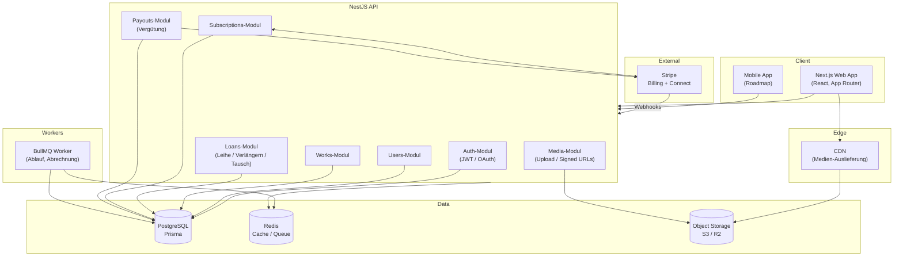
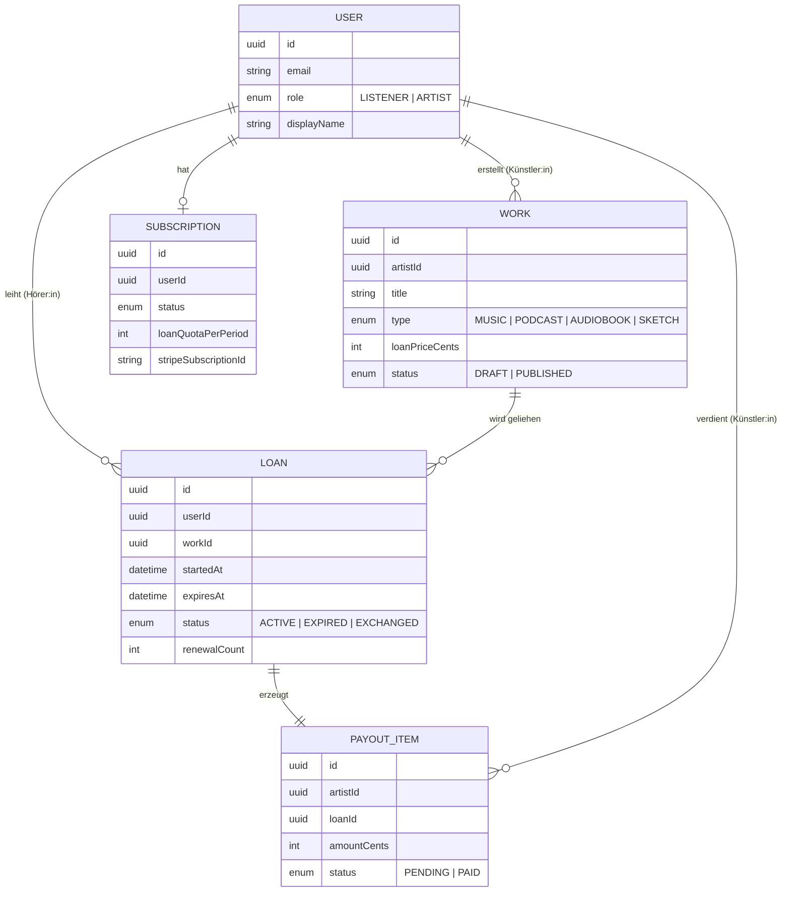

# CreatorLend – Architektur

Dieses Dokument beschreibt die technische Architektur von CreatorLend:
Komponenten, Datenfluss und die wichtigsten Domänenmodelle.

## 1. Überblick

CreatorLend ist ein TypeScript-Monorepo mit einer Next.js-Web-App, einer
NestJS-API, PostgreSQL als primärem Datenspeicher, Redis für Caching/Jobs,
S3-kompatiblem Object Storage für Medien und Stripe für Zahlungen und
Auszahlungen.

## 2. Komponenten

### Web (apps/web)
Next.js App Router. Server Components für Datenabruf, Client Components
für Interaktion. Zuständig für Discovery, Player (zeitlich begrenzter
Zugriff), Abo-Flows und Künstler-Dashboard.

### API (apps/api)
NestJS, modular nach Domäne aufgeteilt:

- **auth** – Registrierung, Login, JWT-Ausgabe, OAuth, Guards.
- **users** – Profile von Hörer:innen und Künstler:innen, Rollen.
- **works** – Einstellen, Metadaten und Veröffentlichung von Werken.
- **loans** – Ausleihen anlegen, verlängern, tauschen, Ablauf prüfen.
- **subscriptions** – Abo-Verwaltung über Stripe Billing.
- **payouts** – Vergütung pro Ausleihe erfassen, Auszahlungen via Connect.
- **media** – Uploads, signierte (zeitlich begrenzte) Zugriffs-URLs.

### Worker (Jobs)
BullMQ-Worker für asynchrone Aufgaben:

- Ablauf von Ausleihen nach 7 Tagen (Zugriff entziehen).
- Aggregation der Vergütung und Vorbereitung von Auszahlungen.
- Versand von Ablauf-Benachrichtigungen.

### Shared (packages/shared)
Geteilte TypeScript-Typen, DTO-Schemata (z. B. zod) und Konstanten,
die sowohl `web` als auch `api` nutzen.

## 3. Domänenmodell (Kern)

## 4. Wichtige Abläufe

### Werk leihen
1. Client ruft `POST /loans` mit `workId` auf.
2. API prüft aktives Abo und verbleibendes Kontingent.
3. `Loan` wird angelegt: `expiresAt = now + 7 Tage`, Status `ACTIVE`.
4. Ein `PayoutItem` wird für die/den Künstler:in mit `loanPriceCents`
   erzeugt (Status `PENDING`).
5. Signierte Medien-URL wird zurückgegeben (gültig bis `expiresAt`).

### Ablauf (Worker)
- Stündlicher Job setzt abgelaufene `ACTIVE`-Loans auf `EXPIRED`.
- Zugriff endet, signierte URLs verlieren Gültigkeit.

### Vergütung & Auszahlung
- `PayoutItem`s werden je Künstler:in aggregiert.
- Periodisch via Stripe Connect ausgezahlt; Status → `PAID`.

## 5. Sicherheit & Zugriff

- Zugriff auf Medien ausschließlich über kurzlebige signierte URLs.
- Rollenbasierte Guards (LISTENER / ARTIST) in der API.
- Stripe-Webhooks signaturverifiziert.
- Zahlungs- und Vergütungsoperationen transaktional in PostgreSQL.

## 6. Deployment

- Alle Dienste containerisiert (Docker).
- Lokal via `docker-compose` (API, Web, Postgres, Redis).
- Cloud: managed Postgres/Redis, Object Storage + CDN, API/Web hinter
  Load Balancer; Worker als separater Service.
